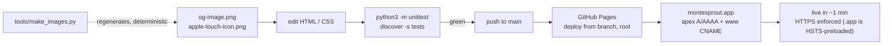
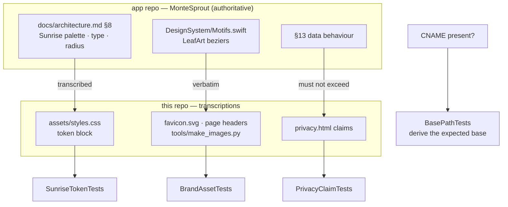

# Overview — montesprout-site as built

> Inferred by `/adopt` from the codebase — verify.
>
> **Present tense only.** What the site *is* today: what a visitor can do, what the files are, and what
> holds it together. Plans live in `docs/ROADMAP.md`; how it got here is `docs/JOURNAL.md`.

---

## What it is

The public marketing and legal site for **MonteSprout**, a calm iOS app for Montessori teachers, by
Mango Grove Labs LLC. Four pages of plain HTML + CSS at **<https://montesprout.app>**, with **zero
JavaScript** and no build step — the repo root *is* the deployed site, and a push to `main` is a deploy.

It exists for two audiences at once: a teacher deciding whether the app is worth a place in their day,
and App Store Connect, which needs a reachable privacy-policy URL before a build can go to external
testers. The second is why the site shipped when it did.

---

## What a visitor can do

| Story | Where | As implemented |
|---|---|---|
| Understand the app at a glance | `index.html` § hero | One headline carrying both strengths — *"Notes in seconds. Reports from evidence, not memory."* — over an "In private beta" badge, with a sub-line naming what the headline leaves implicit (a line, a photo, a voice note). It sells those two outcomes rather than a feature list, because the incumbents' 1.2★/1.9★ iOS reviews complain about capture friction. The headline breaks at the full stop above 40rem via `.hero__break`; runners-up are kept in DECISIONS for the 19.3 A/B. |
| See how it actually works | `index.html` § steps (`#about` then a three-step strip) | Notice → Save → Draft, in prose. This strip is the stand-in for real screenshots; adding those is the one open box (18.7). |
| Judge whether it's different | `index.html` § cards | Five highlight cards. |
| Learn where the data goes | `privacy.html` | The full policy: what's collected, the pseudonymized AI path, the two telemetry toggles, recovery windows, deletion, contact. Carries a "Last updated" date that a test pins against the file's own git date. |
| Get help / ask a question | `support.html` | FAQ answers to the questions a first tester actually asks — where is my data, how do I export, how do I delete, how do I turn analytics off, does it work offline — plus `support@mangogrovelabs.com`. |
| Land on a dead URL and recover | `404.html` | Noindex, links back into the site. Served by GitHub at *any* missing depth, which is why it is the one page with root-absolute links. |

Every content page links to every other from both the nav and the footer, and a test fails if one loses
a link — the nav is copy-pasted, which is exactly how that happens.

---

## Layout

```
index.html  privacy.html  support.html   the three content pages (relative asset paths)
404.html                                 not-found (root-absolute paths — see below)
assets/     styles.css                   Sunrise tokens at the top, then the page styles
            favicon.svg                  the app's LeafArt beziers, verbatim
            og-image.png                 1200×630, generated
            apple-touch-icon.png         180×180, generated
CNAME  .nojekyll  robots.txt  sitemap.xml
tests/      test_site.py                 52 structural tests, stdlib unittest, no install step
tools/      make_images.py               regenerates both PNGs (Pillow, build-time only)
            fonts/                       vendored Quicksand + Nunito (OFL) — never served
docs/  PROGRESS.md  CLAUDE.md  README.md the planning layer (this file's neighbours)
```

`.nojekyll` makes Pages serve every one of those files raw, including the planning layer — public
either way, so `robots.txt` disallows `/docs/`, `/tests/`, `/tools/` and the three root docs to keep
them out of search results rather than out of reach.

## How it deploys



There is no CI, no staging and no secret. `python3 -m http.server` is the preview; the test suite is the
only gate.

---

## What holds it together



Four invariants, each with a test class standing behind it (full statements in `CLAUDE.md`):

1. **Zero JavaScript.** Asserted per page. A script would need a recorded decision first.
2. **Sunrise tokens are transcribed, not invented.** Palette, type and radius values are pinned against
   the app's `architecture.md` §8. Changing one here without changing it there is drift, and the suite
   fails on it.
3. **The leaf mark has one source.** `favicon.svg`, both page headers and the OG generator all carry the
   app's `LeafArt` paths verbatim; a test pins them together, so the site cannot grow a second mark.
4. **Privacy copy is a contract, not marketing.** The app's `PrivacyClaimConventionTests` bans are
   ported to the served HTML, so the page cannot claim notes never leave the device — report generation
   posts pseudonymized text through the proxy. If a claim and the code ever disagree, that's a bug to
   raise in the app repo, never a page to soften.

**And the load-bearing one — the base path.** `tests/test_site.py` derives what it expects from *whether
a `CNAME` file exists*. With the file, every absolute URL must be apex `montesprout.app`; without it,
they must be the old project-subpath form. That is what made the domain move safe: adding the file
turned ten tests red, each naming a URL still on the old base, and the swap was working that list to
green. It guards in both directions and still does.

The PNGs are **generated, never hand-edited**: `tools/make_images.py` renders the same beziers and the
app's own vendored faces, with no PNG `tIME` chunk, so output is byte-identical on any machine and a
regeneration with no content change produces no diff. `og:image:width`/`height` are asserted against the
file's real PNG header, so a resize that skips the meta tags fails.

**Adding a page is never one file.** The page, its `canonical`, its `sitemap.xml` entry, and a link from
every other page's nav *and* footer all move together — the tests fail until they do.
